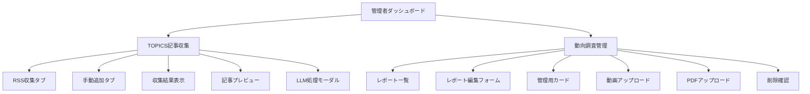

# 管理者用ページ設計案

## 1. 画面構成（トップレベル）

- `/admin`
  - 管理者ダッシュボード（メニュー/リンク集）
- `/admin/topics/collect`
  - TOPICS 配信記事収集
    - RSS 自動収集
    - 手動追加
    - LLM 要約・ラベル付け
    - 収集結果・履歴表示
- `/admin/trend-reports`
  - 動向調査レポート管理
    - レポート一覧・検索
    - レポート新規作成・編集・削除
    - 動画/PDF アップロード
    - 公開設定

---

## 2. 主要機能一覧

### A. TOPICS 配信記事収集

- RSS フィード自動収集
- 手動で記事追加
- LLM による要約・ラベル付け
- 収集結果・履歴の表示
- 記事プレビュー

### B. 動向調査レポート管理

- レポート一覧・検索
- レポート新規作成・編集・削除（CRUD）
- 動画・PDF アップロード
- 公開/非公開設定
- アジェンダ編集

---

## 3. コンポーネント構成（例）

---

## 4. ページ遷移イメージ

- 管理者ダッシュボードから各管理機能へ遷移
- 各機能はタブやボタンでサブ機能に切り替え

---

## 5. 実装方針

- Next.js の app router で `/admin` 配下にページを作成
- features/admin/ 以下に各機能のコンポーネント・hooks・use-case を整理
- 型定義は types/ 配下に集約
- API 連携は libs/api/ 配下で管理

---

この設計案でよろしいでしょうか？  
ご要望や修正点があればご指摘ください。
